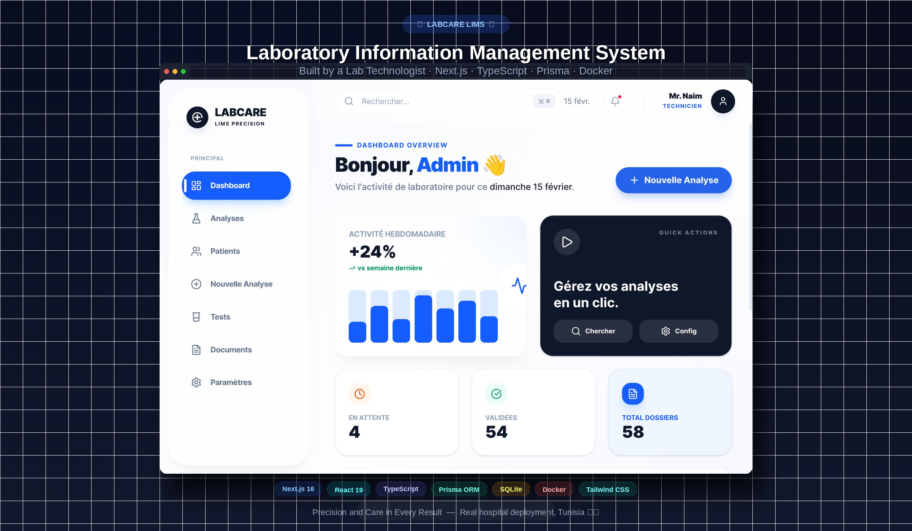

# NexLab - Laboratory Information Management System (LIMS)



**NexLab** is a modern, high-performance Laboratory Information Management System designed to streamline the daily operations of medical laboratories. Built with simplicity and efficiency in mind, it handles everything from patient registration to result reporting with a professional touch.

## ❤️ Why I Built This

As a medical laboratory technologist, I spent years manually writing out patient results, managing piles of paperwork, and worrying about transcription errors. I realized that valuable time spent on administration could be better spent on patient care and analysis accuracy. 

Frustrated by existing solutions that were either too expensive, too complex, or outdated, I decided to build **NexLab**. My goal was to create a LIMS that is intuitive, efficient, and tailored specifically to the real-world needs of a modern laboratory—because I know exactly what those needs are.

## 🚀 Key Features

- **Patient Management**: Complete CRM for patients with history, contact details, and quick search.
- **Analysis Workflow**:
  - fast order creation.
  - Tracking of sample status (Pending, In Progress, Validated).
  - Support for various biological disciplines (Hematology, Biochemistry, etc.).
- **Result Entry**:
  - Intuitive grid for entering results.
  - Automatic flag for abnormal values.
  - Delta check and history comparison (Trend Charts).
- **Professional Reporting**:
  - Generate high-quality PDF reports.
  - **Printable Envelopes**: Integrated "Pochette" envelope templates with automated patient details.
- **Dashboard**: Real-time overview of daily activity, revenue, and pending tasks.
- **Stationery Management**: Centralized repository for generic and specific lab documents.

## 🛠 Tech Stack

- **Framework**: [Next.js 15](https://nextjs.org/) (App Router)
- **Language**: [TypeScript](https://www.typescriptlang.org/)
- **Styling**: [Tailwind CSS](https://tailwindcss.com/) & [Radix UI](https://www.radix-ui.com/)
- **Icons**: [Lucide React](https://lucide.dev/)
- **Database**: SQLite (via [Prisma ORM](https://www.prisma.io/))
- **Printing**: `react-to-print` for pixel-perfect browser printing.
- **Deployment**: Docker containerization support.

## 📦 Getting Started

### Prerequisites

- Node.js 18+
- npm or pnpm

### Installation

1.  **Clone the repository**
    ```bash
    git clone https://github.com/naim/labcare-cssb.git
    cd labcare-cssb
    ```

2.  **Install dependencies**
    ```bash
    npm install
    # or
    pnpm install
    ```

3.  **Setup Database**
    ```bash
    # Create the SQLite database and apply migrations
    npx prisma migrate dev --name init

    # (Optional) Seed the database with initial data
    npx prisma db seed
    ```

4.  **Run Development Server**
    ```bash
    npm run dev
    ```

    Open [http://localhost:3000](http://localhost:3000) to view the app.

## 🐳 Docker Support

To build and run the application using Docker:

```bash
# Build the image
docker build -t nexlab-lims .

# Run the container with volume for database persistence
docker run -p 3000:3000 -v $(pwd)/data:/app/data nexlab-lims
```

> [!IMPORTANT]
> The `-v $(pwd)/data:/app/data` flag ensures your database is stored on your laptop's disk and not just inside the container. This way, you won't lose your data if you stop or delete the container.

## 📂 Project Structure

```
├── app/                  # Next.js App Router pages and API routes
│   ├── analyses/         # Analysis management pages
│   ├── dashboard/        # Main dashboard and administrative views
│   │   ├── documents/    # Stationery and document templates
│   │   └── patients/     # Patient directory and details
│   ├── print/            # Specialized print layouts (Reports, Envelopes)
│   └── api/              # Backend API endpoints
├── components/           # Reusable UI components
│   ├── analyses/         # Analysis-specific forms and inputs
│   ├── print/            # Print templates (EnvelopeImpression, etc.)
│   └── ui/               # Generic UI elements (Buttons, Cards, Inputs)
├── lib/                  # Utilities, types, and database clients
├── prisma/               # Database schema and migrations
└── public/               # Static assets
```

## 📄 License

This project is licensed under the MIT License.

---

**NexLab** — Precision and Care in Every Result.
